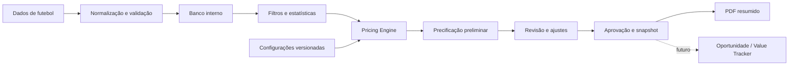

# Visão do produto

## 1. Resumo executivo

**DECISÃO APROVADA:** o Linha de Valor Football Intelligence será uma plataforma web de inteligência de futebol e precificação de mercados. O produto organizará dados históricos, estatísticas, modelos, configurações, análises, odds justas, linhas projetadas e relatórios em um fluxo auditável.

O conhecimento de negócio atualmente distribuído entre planilha, documento Word e prática operacional deverá ser transformado em patrimônio explícito da R21 Labs. Cada resultado deverá poder responder: quais dados foram usados, qual amostra foi selecionada, qual versão do método calculou o resultado, quais ajustes foram aplicados, quem revisou e quando a precificação foi aprovada.

## 2. Problema a resolver

**FATO OBSERVADO:** a planilha atual concentra base de jogos, seleção de amostras, parâmetros, fórmulas, apresentação e geração de PDF em um único arquivo. Essa concentração dificulta rastrear dependências, testar alterações, automatizar dados e preservar resultados históricos.

Os principais problemas são:

- forte dependência da estrutura e do comportamento do Excel;
- regras duplicadas ou implícitas em células;
- erros potencialmente ocultados por fórmulas de tratamento;
- dificuldade para distinguir dados, configuração, cálculo e apresentação;
- relatório excessivamente largo e pouco legível;
- ausência de procedência e identificadores externos por registro;
- dificuldade para versionar métodos e preservar uma precificação antiga;
- barreira para automação e comercialização futura.

## 3. Público e responsabilidades

### 3.1 Usuário inicial

**DECISÃO APROVADA:** Ramon será o usuário administrador inicial. Ele domina futebol, apostas, mercados, probabilidades e a lógica de negócio, mas não deve depender de conhecimento de programação para operar ou validar o produto.

O sistema deve explicar as escolhas em linguagem de negócio, permitir revisão manual e manter Ramon no controle de pesos, contextos, aprovação e publicação.

### 3.2 Público futuro

**HIPÓTESE:** o produto poderá ser comercializado por assinatura. Um assinante poderá consultar estatísticas, probabilidades, odds justas, linhas e relatórios, mas não terá acesso irrestrito às fórmulas, calibrações e versões experimentais.

Essa hipótese influencia segurança e separação de permissões, mas não autoriza implementar cobrança, planos ou múltiplos usuários no MVP.

## 4. Proposta de valor

O produto deve gerar valor por meio de:

- **organização:** uma fonte interna de dados e regras, em vez de dependências espalhadas em células;
- **velocidade:** geração preliminar automática seguida de revisão humana;
- **consistência:** aplicação repetível dos mesmos métodos e filtros;
- **transparência:** explicação da amostra, parâmetros e cálculos utilizados;
- **comparabilidade:** visualização lado a lado dos três métodos;
- **memória:** preservação de versões, justificativas, odds e resultados;
- **evolução:** possibilidade de testar e calibrar modelos sem reescrever o produto inteiro;
- **comercialização:** separação entre conhecimento proprietário e informações exibidas ao assinante.

## 5. Objetivos

### 5.1 Objetivos do produto

- transformar a lógica relevante da planilha em regras e funções testáveis;
- manter uma base normalizada de competições, times, temporadas, partidas e estatísticas;
- produzir precificações reproduzíveis pelos Métodos 1, 2 e 3;
- permitir revisão, ajustes, aprovação e geração de PDF;
- suportar classificação, rankings, histórico e comparação de times;
- preparar integrações com fornecedores e com o futuro Value Tracker.

### 5.2 Objetivo do MVP

**DECISÃO APROVADA:** provar um fluxo vertical para o Brasileirão Série A 2026: importar dados manualmente, selecionar uma partida, formar amostras, calcular os três métodos para os mercados iniciais, revisar, aprovar, preservar o snapshot e gerar um PDF resumido legível.

### 5.3 O que não é objetivo do MVP

- reproduzir todas as telas e todos os mercados da planilha;
- coletar odds ou dados automaticamente;
- oferecer recomendações de aposta ou registrar apostas;
- implementar jogadores, árbitros ou estatísticas avançadas;
- criar microsserviços, assinatura ou cobrança;
- substituir o Value Tracker.

## 6. Jornadas principais

### 6.1 Preparar os dados

1. O administrador importa um arquivo controlado.
2. O sistema valida formato, duplicidades, times, competição e estatísticas.
3. Divergências são exibidas para correção ou conciliação.
4. O lote aceito atualiza a base e fica registrado na auditoria.

### 6.2 Precificar uma partida

1. O administrador seleciona competição, temporada e partida.
2. O sistema monta as amostras e exibe partidas válidas, filtros e quantidade de observações.
3. O sistema gera uma precificação preliminar com os três métodos.
4. O administrador revisa dados e ajusta contextos do Método 1.
5. O sistema recalcula e mostra o efeito dos ajustes.
6. O administrador registra observações e aprova.
7. A aprovação cria um snapshot imutável e permite gerar o PDF.

### 6.3 Consultar desempenho

1. O usuário escolhe campeonato, temporada e recorte.
2. O sistema apresenta classificação geral, casa ou fora.
3. O usuário abre o histórico de um time ou compara dois times.
4. A central da partida reutiliza o mesmo recorte nas análises.

## 7. Princípios do produto

- **DECISÃO APROVADA:** automação preliminar com revisão humana obrigatória antes da aprovação.
- **DECISÃO APROVADA:** configurações do Método 1 seguem a prioridade partida, campeonato e global.
- **RECOMENDAÇÃO:** qualquer número relevante deve permitir navegar até sua amostra e configuração de origem.
- **RECOMENDAÇÃO:** erros não devem ser substituídos silenciosamente por vazios.
- **RECOMENDAÇÃO:** cor deve reforçar informação, nunca ser o único meio de comunicação.
- **RECOMENDAÇÃO:** uma alteração de modelo cria nova versão; nunca reescreve resultados históricos.
- **RECOMENDAÇÃO:** fornecedores são detalhes de integração e não podem contaminar o Pricing Engine.

## 8. Componentes funcionais

Os componentes e suas fronteiras são detalhados em [Arquitetura](07-architecture.md).

## 9. Medidas de sucesso

### 9.1 Discovery

- todas as fórmulas relevantes dos mercados do MVP explicadas em termos de negócio;
- dependências da planilha e limitações de auditoria registradas;
- decisões pendentes visíveis e sem hipóteses apresentadas como fatos;
- MVP, arquitetura, dados e testes documentados de forma executável.

### 9.2 MVP

- resultados reproduzíveis a partir de um snapshot de dados e configuração;
- comparação documentada com pelo menos 12 confrontos de referência;
- probabilidades com política explícita de totalização e tolerância;
- nenhuma aprovação histórica alterada por mudança posterior de modelo;
- PDF legível sem a compressão observada nos exemplos do Excel;
- cada alteração administrativa relevante presente na trilha de auditoria.

## 10. Relação com o Value Tracker

**DECISÃO APROVADA:** o Linha de Valor produz dados, análises, precificações e futuras oportunidades. O Value Tracker registrará apostas, resultados financeiros e desempenho. A fronteira e o contrato futuro estão em [Integração com o Value Tracker](10-value-tracker-integration.md).
