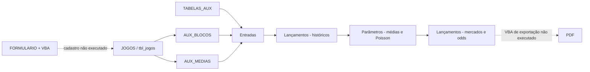

# Estado atual e auditoria da planilha

## 1. Escopo e método de inspeção

**FATO OBSERVADO:** os materiais originais foram tratados como somente leitura. A inspeção utilizou leitura do pacote XLSM, fórmulas armazenadas, valores em cache, estrutura do DOCX, extração textual dos PDFs e inspeção visual das imagens e dos PDFs renderizados.

**LIMITAÇÃO:** esta não foi uma auditoria dinâmica no Excel. Macros, botões, recálculo, formulários e geração operacional do PDF não foram executados.

## 2. Inventário dos materiais

| Material | Evidência observada | Papel no discovery |
|---|---|---|
| `RAMON AUTOMATICA 1.1 2026.xlsm` | Planilha com dados, fórmulas, VBA, controles e relatório | Principal referência funcional e matemática |
| `METODOS E CALCULOS.docx` | Descrição dos Métodos 1, 2 e 3 e dos mercados | Referência conceitual e de intenção de negócio |
| `19 SAO PAULO E ATHLETICO PR.pdf` | Relatório exportado do Excel | Exemplo de conteúdo e problema de impressão |
| `38 WEST HAM E LEEDS.pdf` | Segundo relatório exportado do Excel | Comparação e confirmação do padrão de saída |
| Duas capturas de tela | Lista de partidas e central da partida de terceiro | Referência conceitual de navegação, sem autorização para cópia |

## 3. Visão geral do XLSM

### 3.1 Estrutura

- **FATO OBSERVADO:** 12 abas, sendo 5 visíveis e 7 ocultas.
- **FATO OBSERVADO:** nenhuma aba foi identificada como `veryHidden`.
- **FATO OBSERVADO:** a aba ativa armazenada é `Entradas`.
- **FATO OBSERVADO:** existe uma tabela estruturada chamada `tbl_jogos`.
- **FATO OBSERVADO:** existem 16 nomes definidos, incluindo listas de campeonatos, temporadas e times.
- **FATO OBSERVADO:** existem validações de dados para datas, campeonatos, temporadas e times.
- **FATO OBSERVADO:** existem sete controles ActiveX relacionados a seleção de times, novo jogo, salvamento e limpeza de formulário.
- **FATO OBSERVADO:** existe um projeto VBA com aproximadamente 77 KB.
- **FATO OBSERVADO:** não foram encontrados vínculos externos, Power Query, conexões ou tabelas dinâmicas no pacote.

### 3.2 Inventário por aba

| Aba | Estado | Objetivo observado | Entradas/saídas principais | Destino sugerido | Risco ou pendência |
|---|---|---|---|---|---|
| `Resumo` | Oculta | Versão anterior de históricos e mercados | Times, médias e tabelas de probabilidade | Legado a comparar | Sem referências de fórmula observadas; contém rótulos possivelmente antigos |
| `FORMULARIO` | Visível | Cadastro manual de partidas | Data, campeonato, temporada, times e 20 estatísticas | Importação/administração | Depende de VBA não executado |
| `Entradas` | Visível | Seleção da análise e configuração do Método 1 | Campeonato, temporada, times, pesos, multiplicadores e observações | Central da partida/configuração | Mistura entrada, visualização e dados derivados |
| `Lançamentos` | Visível | Relatório completo e cálculo de mercados | Históricos, estatísticas, métodos, odds justas e linhas | Interface, relatórios e serviços separados | 5.570 fórmulas, 365 mesclagens e alta complexidade visual |
| `Parâmetros` | Oculta | Cálculos intermediários e matrizes de placar | Médias refinadas, Poisson e probabilidades | Pricing Engine | Matriz limitada a 6 × 6 e forte dependência de referências celulares |
| `JOGOS` | Visível | Base de partidas | 2.129 linhas e 25 colunas | Banco interno e importação | Sem IDs externos ou procedência por registro |
| `TABELAS_AUX` | Visível | Listas para validação | Campeonatos, temporadas e times | Cadastros normalizados | Nomes e duplicidades dependem de conferência manual |
| `AUX_BLOCOS` | Oculta | Filtrar e ordenar jogos do mandante e visitante | `tbl_jogos` e seleção de `Entradas` | Serviço de amostras | Fórmulas dinâmicas e dependência de recursos recentes do Excel |
| `AUX_MEDIAS` | Oculta | Calcular médias do campeonato | Campeonato, temporada e estatísticas | Serviço estatístico | Tratamento de ausências precisa ser formalizado |
| `METODO 02` | Oculta | Protótipo do Método 2 para gols | Históricos, médias da liga e Poisson | Legado de validação | Sem referências diretas observadas a partir das telas principais |
| `ULTIMOS 10` | Oculta | Protótipo do Método 3 | Frequências em dez jogos | Legado de validação | Algumas fórmulas usam `COUNTA` sobre células com fórmula |
| `Planilha2` | Oculta | Notas e lista inicial de mercados | Rótulos e comentários manuais | Conhecimento a consolidar | Não deve permanecer como fonte normativa isolada |

**RISCO:** ausência de referência de fórmula não prova que uma aba é descartável. Uma macro ou operação manual pode utilizá-la. A classificação como legado só poderá ser concluída após a auditoria dinâmica.

## 4. Base de jogos

### 4.1 Perfil observado

- 2.129 partidas;
- 25 campos: data, competição, temporada, mandante, visitante e 20 estatísticas;
- 10 campeonatos com registros;
- período entre 17 de maio de 2025 e 17 de julho de 2026;
- temporadas armazenadas como 2026 e, em quatro registros, 2027;
- nenhuma célula vazia nos registros inspecionados;
- nenhuma duplicidade pela chave provisória data, competição, mandante e visitante;
- nenhuma estatística negativa;
- nenhuma inconsistência básica em que valor do primeiro tempo excedesse o total da partida;
- chutes no gol não excederam finalizações nos testes estruturais executados.

### 4.2 Limitações da base

- **RISCO:** um zero pode representar ocorrência real ou dado indisponível preenchido como zero.
- **FATO OBSERVADO:** não há campo de fornecedor, ID externo, data de importação, versão da correção ou responsável por registro.
- **RISCO:** o campo `Temporada` usa um rótulo numérico que precisa ser separado de datas reais de início e fim, especialmente em calendários que atravessam dois anos.
- **RECOMENDAÇÃO:** toda estatística futura deve guardar valor, disponibilidade, origem e revisão, permitindo distinguir `0`, `não informado` e `não aplicável`.

## 5. Dependências observadas

**FATO OBSERVADO:** `Lançamentos` referencia intensamente `Entradas` e `Parâmetros`; `Parâmetros` usa estatísticas intermediárias de `Lançamentos`. Esse ciclo em nível de abas não significa necessariamente referência circular de células, mas aumenta a dificuldade de entendimento.

## 6. VBA, controles e formulário

Foram identificados controles com nomes compatíveis com:

- seleção de mandante e visitante;
- criação de novo jogo;
- salvamento do formulário;
- limpeza do formulário;
- exportação manual da área de impressão para PDF.

Também foram encontradas referências textuais a rotinas de inclusão de `SEERRO/IFERROR` em fórmulas e exportação `ExportAsFixedFormat`.

**LIMITAÇÃO:** o código fonte completo dos módulos não foi extraído porque `oletools/olefile` não estava disponível e a instalação de dependências era proibida.

**Impacto:** efeitos colaterais, validações, células alteradas, nomes de módulos e tratamento de falhas das macros não podem ser considerados auditados.

**Procedimento futuro recomendado:** copiar o XLSM para uma pasta temporária; abrir a cópia no Microsoft Excel com macros inicialmente desabilitadas; exportar módulos e formulários; revisar o código; executar cada fluxo com dados de teste; comparar hashes do original antes e depois.

## 7. Fórmulas e achados matemáticos preliminares

### 7.1 Matriz de placares

**FATO OBSERVADO:** as matrizes examinadas calculam placares de 0 a 6 gols para cada time.

**RISCO:** resultados com sete ou mais gols de qualquer participante ficam fora da soma. No confronto armazenado na planilha, as probabilidades de resultado dos Métodos 1 e 2 totalizam aproximadamente 99,85% e 99,82%.

- **DECISÃO PENDENTE:** definir tratamento da cauda da distribuição.
- **RECOMENDAÇÃO:** calcular até um limite adaptativo que deixe massa residual abaixo da tolerância aprovada, registrando a massa omitida; preferir fórmulas analíticas quando disponíveis.

### 7.2 Cores

**DECISÃO APROVADA:** baixa probabilidade é menor que 40%; intermediária é de 40% a 60%; alta é maior que 60%.

**FATO OBSERVADO:** regras da planilha usam limites como `<39,9%` e `>60,1%`, criando pequenos intervalos sem correspondência exata com a decisão.

- **RECOMENDAÇÃO:** centralizar os limites em configuração versionada e usar os mesmos valores na plataforma e no PDF.

### 7.3 Tratamento de erros

**FATO OBSERVADO:** `IFERROR/SEERRO` é a função dominante em `Lançamentos`.

**RISCO:** transformar qualquer erro em vazio dificulta distinguir ausência normal, divisão por zero, referência quebrada e falha de cálculo.

- **RECOMENDAÇÃO:** validar entradas antes de calcular, retornar erros de domínio identificáveis e impedir aprovação de precificação incompleta.

### 7.4 Legado e inconsistências

**FATO OBSERVADO:** abas antigas contêm rótulos como handicap `+1,4`, enquanto a área principal usa linhas de 0,25.

**FATO OBSERVADO:** a aba oculta `ULTIMOS 10` possui fórmulas com `COUNTA` sobre intervalos que incluem fórmulas, embora o Método 3 principal use testes `ISNUMBER` para contar jogos válidos.

- **DECISÃO PENDENTE:** classificar cada uma dessas abas como vigente, referência histórica ou descartável.
- **RECOMENDAÇÃO:** não migrar fórmula de aba legada sem confirmar se ela participa do fluxo atual.

## 8. PDFs atuais

**FATO OBSERVADO:** os dois PDFs possuem uma primeira página A4 paisagem com muitas tabelas comprimidas e uma segunda página vazia.

**Impacto:** embora o conteúdo seja amplo, sua leitura em tela ou impressão é prejudicada e a página vazia sugere área de impressão excessiva.

**RECOMENDAÇÃO:** reorganizar o relatório em seções e páginas temáticas, conforme [Experiência do usuário e PDF](09-user-experience-and-pdf.md), sem reproduzir a largura da planilha.

## 9. Limitações consolidadas

| Não verificado | Motivo | Impacto | Procedimento futuro |
|---|---|---|---|
| Execução de macros e botões | XLSM não foi aberto ou executado | Fluxo operacional e efeitos não confirmados | Executar cópia temporária após revisão do VBA |
| Código VBA completo | Biblioteca de extração indisponível e instalação proibida | Módulos e tratamento de erros incompletos | Exportar com Excel ou usar ferramenta aprovada |
| Recálculo integral | Análise estática e por valores em cache | Resultados podem estar desatualizados | Recalcular cópia no Excel e congelar evidências |
| Layout completo do DOCX | LibreOffice ausente | Não há garantia sobre paginação e formatação | Renderizar com Word ou instalar ferramenta aprovada |
| Origem de cada registro | Planilha não armazena procedência | Qualidade e licença não auditáveis | Localizar fonte e documentar linhagem |
| Operação real de geração do PDF | Macro não executada | Nome, destino e comportamento não confirmados | Teste controlado em cópia temporária |

## 10. Entregáveis da auditoria completa

Antes da implementação, a auditoria deverá complementar este documento com:

- fonte e responsabilidade de cada módulo VBA;
- mapa célula a célula dos mercados do MVP;
- inventário de intervalos de entrada, cálculo e saída;
- relatório de fórmulas duplicadas e divergentes;
- massa residual da Poisson em diferentes cenários;
- comportamento de vazios, zeros e erros;
- comparação de pelo menos 12 confrontos de referência;
- decisão formal sobre cada aba legada.
