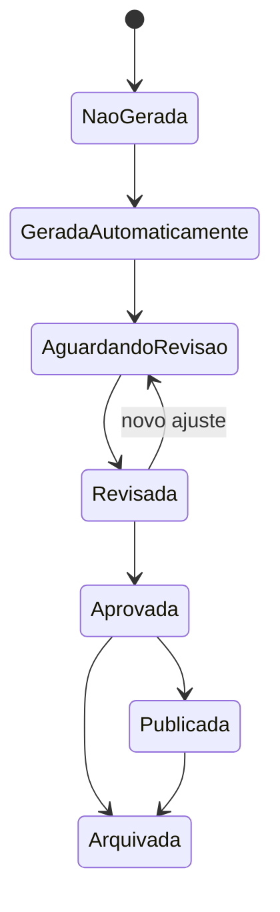

# Regras de negócio e catálogo de mercados

## 1. Finalidade

Este documento centraliza a linguagem canônica de mercados, linhas, amostras, liquidação e workflow. Os cálculos dos três métodos estão em [Modelos de precificação](04-pricing-models.md), e as entidades persistidas estão em [Domínio e modelo de dados](06-domain-and-data-model.md).

## 2. Amostras e filtros

### 2.1 Definição de amostra

Uma amostra é o conjunto ordenado de partidas válidas usado em um cálculo. Ela deve ser reproduzível e registrar:

- competição e temporada;
- time e condição de mandante ou visitante;
- período inicial e final;
- quantidade solicitada e quantidade efetivamente encontrada;
- competições incluídas ou excluídas;
- copas e amistosos incluídos ou excluídos;
- temporadas incluídas;
- regra de recência e respectivos pesos;
- estatística e período do jogo analisados;
- IDs das partidas utilizadas;
- versão dos dados no momento do cálculo.

**DECISÃO APROVADA:** o sistema deverá suportar últimos 5, 10, 15 e 20 jogos, temporada completa e período personalizado, além de recortes casa, fora e geral.

**RECOMENDAÇÃO:** o MVP implementará a infraestrutura desses filtros, mas a validação inicial usará o padrão observado de últimos dez jogos do mandante em casa e do visitante fora.

### 2.2 Validade de uma observação

Uma partida é válida para uma estatística quando:

- está encerrada;
- pertence aos filtros selecionados;
- possui identificação válida de competição, temporada e participantes;
- possui a estatística marcada como disponível;
- o valor é compatível com a unidade e não viola as validações do domínio.

**DECISÃO PENDENTE:** confirmar se partidas anuladas, interrompidas, decididas por W.O. ou prorrogadas entrarão em cada mercado.

### 2.3 Zeros, vazios e ausência

**DECISÃO APROVADA — D-MATH-009 e D-MATH-010:**

- `0` significa valor observado igual a zero.
- `ausente` significa que o fornecedor ou arquivo não trouxe a estatística.
- `não aplicável` significa que a estatística não existe para aquele contexto.
- Um valor ausente não entra no denominador do Método 3 nem nas médias dos Métodos 1 e 2.
- Estados inválido e pendente de revisão permanecem distintos e podem bloquear cálculo.

**RISCO:** a planilha atual não permite provar se todos os zeros representam observações reais.

## 3. Catálogo canônico

Cada resultado precificado deverá ser identificado pelos seguintes campos:

| Campo | Definição | Exemplo |
|---|---|---|
| Mercado | Família econômica do resultado | `asian_handicap` |
| Período | Trecho da partida | `first_half`, `full_time` |
| Participante | Escopo da estatística | mandante, visitante, partida |
| Seleção | Resultado comprado | mandante, visitante, empate, over, under, sim, não |
| Linha | Limite numérico canônico | `-0,75`, `2,50` |
| Incremento | Passo natural do catálogo | `0,25` para handicap e total asiático |
| Unidade | Tipo da medição | gols, escanteios, cartões, ocorrências |
| Resultado | Valor ou estado observado | mandante venceu por um gol |
| Liquidação | Efeito financeiro abstrato | vitória, meia vitória, reembolso, meia derrota, derrota |

**DECISÃO APROVADA — D-MATH-003:** linhas asiáticas serão armazenadas como unidades inteiras de quartos. Probabilidades e odds usarão `binary64/double`, com valor bruto preservado e arredondamento apenas na apresentação.

## 4. Mercados por etapa

### 4.1 MVP aprovado

- resultado do primeiro tempo e da partida;
- dupla chance do primeiro tempo e da partida;
- ambas marcam;
- gols do primeiro tempo e da partida;
- gols do mandante e do visitante;
- handicap asiático do mandante e visitante, de `-2,00` a `+2,00`.

**RECOMENDAÇÃO:** resultado correto pode ser calculado internamente para formar outros mercados, mas sua exposição como mercado comercial fica fora do primeiro MVP.

### 4.2 Segunda etapa

- escanteios, inclusive primeiro tempo e por time;
- finalizações e chutes no gol, inclusive primeiro tempo e por time;
- cartões e faltas, inclusive por time;
- PDF completo;
- rankings estatísticos ampliados.

### 4.3 Etapas futuras

- mercados de jogadores;
- odds, valor esperado e oportunidades;
- mercados ao vivo;
- integração ativa com o Value Tracker.

## 5. Regras de mercados iniciais

### 5.1 Resultado e dupla chance

- Resultado 1X2: soma das probabilidades dos placares em que mandante vence, empata ou visitante vence.
- Dupla chance `1X`: mandante vence ou empata.
- Dupla chance `X2`: visitante vence ou empata.
- **DECISÃO PENDENTE:** confirmar se `12`, vitória de qualquer time sem empate, será exibida no MVP.

### 5.2 Ambas marcam

- `Sim`: ambos os times marcam pelo menos um gol.
- `Não`: pelo menos um time termina sem marcar.
- As duas probabilidades devem somar 100% dentro da tolerância aprovada.

### 5.3 Totais de gols

- Linha `n,5`: não possui reembolso; over vence quando o total é maior que a linha e under quando é menor.
- Linha inteira e linha de quarto: devem usar as mesmas regras de divisão e reembolso dos mercados asiáticos.
- **DECISÃO PENDENTE:** definir quais linhas de total serão expostas no MVP, embora o catálogo suporte incremento de `0,25`.

## 6. Handicap asiático

### 6.1 Regra geral

Para a seleção do mandante, considere:

`diferença = gols do mandante - gols do visitante`

O handicap é somado à diferença. Para a seleção do visitante, a diferença é calculada pela perspectiva do visitante. Uma linha de quarto divide a aposta conceitualmente em duas metades nas linhas adjacentes.

### 6.2 Estados de liquidação

| Estado | Efeito sobre a unidade | Exemplo |
|---|---:|---|
| Vitória integral | `+100%` da parcela vencedora | `-0,5` e o time vence |
| Meia vitória | metade vence e metade é reembolsada | `+0,25` e o jogo termina empatado |
| Reembolso | `0` | `0,0` e o jogo empata |
| Meia derrota | metade perde e metade é reembolsada | `+0,25` e o time perde por um gol não se aplica; ocorre, por exemplo, em `+0,75` perdendo por um |
| Derrota integral | `-100%` | `-0,5` e o time empata ou perde |

Para evitar ambiguidade, a meia vitória e a meia derrota devem ser derivadas das duas linhas componentes, não de rótulos informais.

### 6.3 Linhas do MVP

| Linha canônica | Divisão para liquidação |
|---:|---|
| `-2,00` | `-2,00` |
| `-1,75` | 50% em `-2,00` e 50% em `-1,50` |
| `-1,50` | `-1,50` |
| `-1,25` | 50% em `-1,50` e 50% em `-1,00` |
| `-1,00` | `-1,00` |
| `-0,75` | 50% em `-1,00` e 50% em `-0,50` |
| `-0,50` | `-0,50` |
| `-0,25` | 50% em `-0,50` e 50% em `0,00` |
| `0,00` | `0,00` |
| `+0,25` | 50% em `0,00` e 50% em `+0,50` |
| `+0,50` | `+0,50` |
| `+0,75` | 50% em `+0,50` e 50% em `+1,00` |
| `+1,00` | `+1,00` |
| `+1,25` | 50% em `+1,00` e 50% em `+1,50` |
| `+1,50` | `+1,50` |
| `+1,75` | 50% em `+1,50` e 50% em `+2,00` |
| `+2,00` | `+2,00` |

### 6.4 Odd justa com liquidação parcial

**DECISÃO APROVADA — D-MATH-012:** calcular a odd justa pela liquidação completa das parcelas:

`odd justa = 1 + perdas equivalentes / vitórias equivalentes`

Em que:

- `vitórias equivalentes = P(vitória integral) + 0,5 × P(meia vitória)`;
- `perdas equivalentes = P(derrota integral) + 0,5 × P(meia derrota)`;
- reembolsos não entram em vitórias nem perdas equivalentes.

**FATO OBSERVADO:** 408 de 408 casos independentes foram aprovados contra a semântica observada no Excel. O Word permanece referência conceitual, não especificação normativa isolada.

**DECISÃO APROVADA — D-MATH-005:** a linha principal será a de odd justa mais próxima de 2,00; em empate matemático, prevalece a linha mais próxima de zero, com simetria entre mandante e visitante. Todas as linhas calculadas serão preservadas.

## 7. Catálogo de incrementos

- Handicap asiático: `0,25`.
- Total asiático de gols: `0,25`.
- Linhas `n,5` convencionais: `1,00` entre linhas equivalentes.
- Estatísticas futuras: incremento definido por mercado e fornecedor, sem inferência por diferença numérica absoluta.

O conceito de “uma linha de diferença” deverá comparar posições no catálogo, e não apenas subtrair números.

## 8. Classificação e rankings

### 8.1 Classificação

- Geral: todas as partidas válidas da competição e temporada.
- Casa: somente partidas em que o time foi mandante.
- Fora: somente partidas em que o time foi visitante.
- Regras de pontos, desempate, fases e grupos pertencem à edição da competição.

### 8.2 Rankings

O MVP exibirá ranking básico de gols feitos e sofridos. Filtros mínimos: competição, temporada, recorte, local e ordenação crescente ou decrescente.

**RECOMENDAÇÃO:** rankings devem reutilizar o mesmo serviço de amostras da precificação, evitando cálculos diferentes para a mesma definição.

## 9. Cores e acessibilidade

**DECISÃO APROVADA:** faixas iniciais:

- menor que 40%: baixa;
- de 40% a 60%, inclusive: intermediária;
- maior que 60%: alta.

**RECOMENDAÇÃO:** usar vermelho, amarelo/laranja e verde como apoio, acompanhado de rótulo ou ícone. As faixas deverão ser configuração versionada e aplicada igualmente na plataforma e nos PDFs.

## 10. Workflow da precificação

- **DECISÃO APROVADA — D-MATH-016:** uma precificação aprovada não pode ser recalculada no mesmo registro.
- Qualquer alteração de dados, filtros, amostra, parâmetros, pesos, multiplicadores, método, versão ou regra cria nova revisão e novo snapshot vinculados ao anterior.
- Publicação fica preparada conceitualmente, mas não será exposta a assinantes no MVP.

## 11. Decisões pendentes deste catálogo

- tratamento de partidas anuladas, W.O., prorrogação e disputa por pênaltis;
- inclusão da dupla chance `12`;
- linhas de total de gols exibidas no MVP;
- convenção para cartões vermelhos e múltiplos cartões no mesmo lance;
- regras específicas por competição para classificação e desempate.
