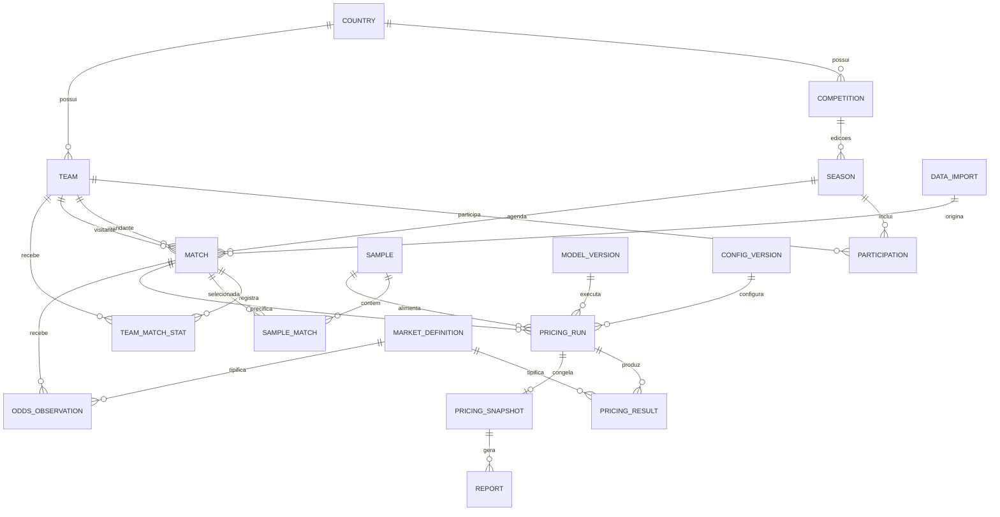

# Domínio e modelo preliminar de dados

## 1. Princípios de modelagem

- Um time possui identidade permanente; sua participação varia por competição e temporada.
- Identificadores internos são independentes de fornecedores.
- Dados observados, configurações, cálculos e apresentações são armazenados separadamente.
- Correções preservam procedência e histórico.
- Uma precificação aprovada é representada por snapshot imutável.
- O modelo é preliminar: nomes físicos de tabelas e tipos exatos serão definidos na arquitetura aprovada.

## 2. Linguagem do domínio

| Conceito | Definição |
|---|---|
| Competição | Torneio permanente, como Brasileirão Série A |
| Temporada | Edição temporal de uma competição |
| Participação | Associação de um time a uma temporada |
| Partida | Evento entre mandante e visitante em data e fase definidas |
| Estatística | Contagem observada para time, período e partida |
| Amostra | Conjunto reproduzível de partidas válidas usado em cálculo |
| Modelo | Método matemático ou estatístico versionado |
| Configuração | Valores que controlam um modelo ou apresentação |
| Precificação | Processo e resultados calculados para uma partida |
| Snapshot | Registro congelado da precificação aprovada |
| Mercado | Família de resultado precificado |
| Seleção | Lado específico do mercado |
| Observação de odd | Preço capturado para seleção e horário determinados |

## 3. Visão das entidades

## 4. Entidades de futebol

### 4.1 Country

País canônico, com nome, código e estado ativo. Evita repetir texto em times e competições.

### 4.2 Competition

Identidade permanente da competição: nome oficial, nome curto, país, modalidade e identificadores externos.

### 4.3 Season

Edição da competição: rótulo, datas de início e fim, formato, estado, fases e regras de classificação.

**RECOMENDAÇÃO:** o rótulo “2026” não substitui datas; temporadas que atravessam anos devem manter rótulo e período separados.

### 4.4 Team

Nome oficial, nome curto, sigla, país, cidade, estádio, escudo, nomes anteriores e estado. Promoção ou rebaixamento não cria novo time.

### 4.5 Participation

Relaciona time e temporada, com grupo, fase, posição inicial, penalidades de pontos e estado.

### 4.6 Match

Temporada, fase, rodada, data/hora, timezone, mandante, visitante, estádio e estado. Resultados devem distinguir primeiro tempo, tempo regulamentar, prorrogação e pênaltis quando aplicável.

**DECISÃO PENDENTE:** política de partidas adiadas, anuladas, W.O. e neutras.

### 4.7 TeamMatchStat

Registra estatística de um time em uma partida, com:

- tipo canônico;
- período;
- valor decimal ou inteiro;
- unidade;
- disponibilidade;
- fonte e observação;
- versão/correção.

Esse formato evita criar uma nova coluna física para toda estatística futura, mas deverá ser avaliado contra desempenho e simplicidade no ADR de dados.

## 5. Identidade, aliases e fornecedores

`ExternalEntityMapping` relacionará entidade interna, fornecedor, tipo externo e ID externo. `EntityAlias` guardará nomes alternativos e período de validade.

Fluxo de normalização:

1. procurar mapeamento por ID externo;
2. procurar alias exato dentro do fornecedor e competição;
3. sugerir correspondência, sem confirmar automaticamente quando houver ambiguidade;
4. exigir decisão administrativa;
5. preservar o mapeamento usado.

**RISCO:** vincular somente por nome pode unir times diferentes ou duplicar o mesmo time.

## 6. Importação e procedência

`DataImport` representa o lote e registra arquivo, hash, formato, fornecedor, usuário, horário, estado, totais e erros. Cada registro importado mantém ligação com lote e linha de origem.

Correções administrativas devem registrar:

- valor anterior e novo;
- campo afetado;
- motivo;
- autor e horário;
- fonte de confirmação;
- necessidade de reprocessar agregações e precificações não aprovadas.

Snapshots aprovados não serão alterados; uma correção poderá gerar nova revisão comparável.

## 7. Amostras e estatísticas derivadas

`Sample` guarda a definição dos filtros e a versão dos dados. `SampleMatch` guarda IDs, ordem, lado do time e disponibilidade da estatística.

**RECOMENDAÇÃO:** não armazenar apenas “últimos 10”. Guardar as dez partidas efetivamente usadas permite reproduzir o cálculo mesmo após novas partidas serem importadas.

Agregações como média, desvio-padrão e frequência podem ser recalculadas ou mantidas em cache. O cache deve ser invalidado por versão dos dados e filtros.

## 8. Modelos e configurações

### 8.1 ModelVersion

Nome, versão, status, mercados suportados, referência à especificação, data e responsável.

### 8.2 ConfigurationVersion

Escopo global, campeonato ou partida; mercado; valores; justificativa; autor; vigência; versão substituída.

**RECOMENDAÇÃO:** armazenar parâmetros em estrutura validada por versão, sem permitir campos arbitrários não documentados.

## 9. Precificação e snapshots

### 9.1 PricingRun

Execução de um método para uma partida. Mantém estado, modelo, configuração, amostra, horários, responsável, erros e resultados intermediários.

### 9.2 PricingResult

Mercado, período, participante, seleção, linha, probabilidade, odd justa, linha projetada e metadados de precisão.

### 9.3 PricingSnapshot

Criado na aprovação e imutável. Deve incluir cópia lógica de:

- dados e partidas da amostra;
- parâmetros resolvidos após precedência;
- versão do modelo;
- resultados e intermediários necessários à auditoria;
- observações e responsável;
- hash ou assinatura do conteúdo.

**RECOMENDAÇÃO:** novas revisões referenciam a anterior, formando histórico sem sobrescrita.

## 10. Mercados e odds

`MarketDefinition` implementa a linguagem do [catálogo](03-business-rules-and-market-catalog.md), incluindo incremento e regra de liquidação.

`OddsObservation` é futura e append-only: novas capturas criam registros. Campos mínimos: partida, fornecedor, casa, mercado, seleção, linha, odd, formato, pré-jogo/ao vivo, horário, estado, origem e ID externo.

## 11. Relatórios e auditoria

`Report` registra snapshot, tipo, template, versão, arquivo, hash, horário, usuário e estado.

`AuditEvent` registra ator, ação, alvo, antes/depois quando permitido, justificativa, horário e identificador de correlação.

**RECOMENDAÇÃO:** logs técnicos não substituem a auditoria de negócio; ambos possuem finalidades diferentes.

## 12. Usuários e futuro comercial

O MVP precisa de `User`, credencial segura, papel e preferências mínimas. Estruturas de organização e plano não serão criadas sem uso real.

**RECOMENDAÇÃO:** manter `owner_user_id` e regras de autorização nos recursos que futuramente possam variar por usuário, sem implementar cobrança ou tenancy completa.

## 13. Entidades futuras

- Player, PlayerParticipation e PlayerMatchStat;
- Referee e RefereeMatchAssignment;
- Stadium como entidade enriquecida;
- Organization, Subscription e Plan;
- Opportunity e integração com o Value Tracker.

Sua existência conceitual não autoriza tabelas ou código no MVP.
