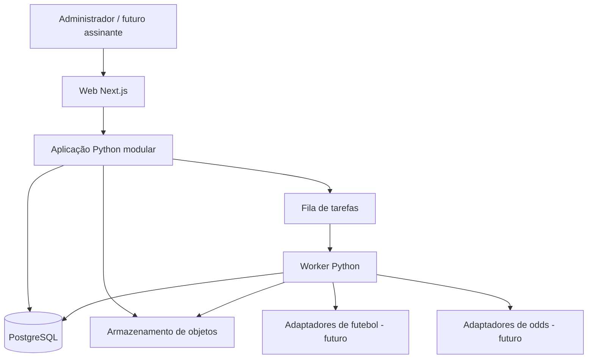
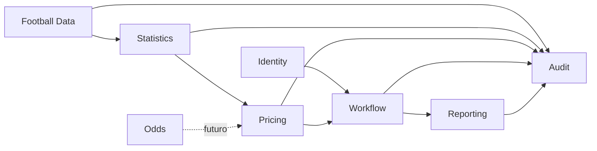

# Arquitetura

## 1. Direção arquitetural

**RECOMENDAÇÃO APROVADA COMO BASE:** iniciar com monólito modular: uma aplicação organizada em módulos internos, implantada e versionada de forma coordenada.

**DECISÃO APROVADA:** não adotar microsserviços no estágio inicial. Separação de responsabilidades será feita no código e no modelo de domínio, sem criar complexidade de rede e operação.

## 2. Tecnologias candidatas

- front-end web: Next.js e TypeScript;
- back-end e Pricing Engine: Python;
- banco transacional: PostgreSQL;
- worker: processo do mesmo back-end para tarefas demoradas;
- arquivos: armazenamento de objetos para PDFs e importações;
- implantação: coordenada, com versões compatíveis de web, API e worker.

**DECISÃO PENDENTE:** FastAPI ou Django. Um ADR deverá comparar:

- autenticação e administração;
- validação e APIs;
- tarefas assíncronas;
- maturidade do ORM e migrations;
- simplicidade para uma equipe inicial de uma pessoa;
- experiência de desenvolvimento com Codex;
- testes, segurança, implantação e manutenção.

## 3. Visão de contêineres

Web e back-end poderão ser processos diferentes, mas o domínio permanece um monólito modular, com um único ciclo coordenado de evolução.

## 4. Módulos conceituais

### 4.1 Identity

Autenticação, usuários, papéis, sessões e autorização. Não conhece fórmulas de precificação.

### 4.2 Football Data

Competições, temporadas, times, partidas, estatísticas, importações, aliases, IDs externos e correções.

### 4.3 Statistics

Amostras, filtros, médias, dispersão, classificação e rankings. É a única fonte de agregações para interface e Pricing.

### 4.4 Pricing

Modelos, versões, configurações, Poisson, probabilidades, odds justas, linhas e snapshots.

### 4.5 Odds

Catálogo e observações de mercado. O módulo existe como fronteira arquitetural, mas a integração fica fora do MVP.

### 4.6 Workflow

Estados, geração, revisão, aprovação, publicação futura e arquivamento.

### 4.7 Reporting

Templates, jobs, arquivos, hashes e autorização de download.

### 4.8 Audit

Eventos de negócio, correlação, histórico de alterações e consultas de rastreabilidade.

## 5. Fluxos principais

### 5.1 Importação

`arquivo → validação → normalização → prévia → confirmação → banco → invalidação de cache → auditoria`

Uma importação falha não pode deixar lote parcialmente confirmado sem identificação. Registros pendentes de conciliação permanecem fora dos cálculos.

### 5.2 Precificação

`partida → filtros → amostra congelada → estatísticas → modelos → revisão → aprovação → snapshot → PDF`

### 5.3 Reprocessamento

Correção de dado ou nova versão pode marcar precificações não aprovadas como desatualizadas. Snapshots aprovados permanecem intactos e podem originar uma nova revisão.

## 6. Interfaces futuras

As interfaces abaixo são contratos conceituais, não APIs implementadas.

### 6.1 FootballDataProvider

Responsabilidade: localizar competições, partidas, resultados e estatísticas no formato do fornecedor e entregá-los ao normalizador.

Operações conceituais:

- listar competições e temporadas;
- buscar partidas atualizadas por período;
- buscar estatísticas de partidas;
- informar limites, cobertura e cursor de sincronização.

### 6.2 OddsProvider

Responsabilidade: obter observações de odds sem conhecer regras internas de precificação.

Operações conceituais:

- listar eventos e casas;
- buscar mercados e preços por janela;
- devolver horário, linha, seleção, estado e identificadores externos.

### 6.3 PricingEngine

Responsabilidade: receber dados já normalizados e calcular um método versionado.

Entrada conceitual: partida, mercado, modelo, configuração resolvida, amostra e versão dos dados.

Saída: intermediários, probabilidades, odds justas, linhas, massa residual, avisos e erros.

### 6.4 PricingSnapshot

Contrato imutável da aprovação, detalhado no [modelo de domínio](06-domain-and-data-model.md#93-pricingsnapshot).

### 6.5 Evento `pricing.approved`

Evento futuro emitido após transação bem-sucedida de aprovação. Deve carregar apenas IDs, versões, resumo autorizado e referência ao snapshot, conforme [integração com o Value Tracker](10-value-tracker-integration.md).

## 7. Tarefas automáticas

O worker deverá suportar, conforme cada etapa do roadmap:

- validação e processamento de importações;
- atualização de agregações;
- geração preliminar em janela futura;
- geração de PDF;
- sincronização de fornecedores;
- reprocessamento controlado.

**RECOMENDAÇÃO:** começar com uma fila simples e poucos tipos de tarefa. Não adotar plataforma distribuída antes de necessidade comprovada.

## 8. Desempenho e cache

- Índices serão orientados pelas consultas reais: temporada, competição, data, mandante e visitante.
- Agregações frequentes podem ser armazenadas em cache com chave incluindo filtros e versão dos dados.
- Snapshot nunca depende de cache mutável para reprodução.
- **DECISÃO PENDENTE:** tecnologia de fila e cache será escolhida após medir a primeira implementação.

## 9. Segurança

- autenticação e autorização no servidor;
- senhas com algoritmo de hash apropriado;
- proteção contra importação maliciosa e arquivos excessivos;
- segredos fora do repositório;
- princípio do menor privilégio no banco e armazenamento;
- URLs temporárias ou autorização mediada para PDFs;
- registro de ações administrativas;
- proteção do código e dos parâmetros proprietários.

**RISCO:** expor todos os intermediários ao navegador pode revelar conhecimento proprietário. A API deverá entregar apenas o necessário ao papel do usuário.

## 10. Operação, backup e observabilidade

- logs estruturados com ID de correlação;
- métricas de latência, falhas, jobs, importações e cálculos;
- rastreamento de versão da aplicação e dos modelos;
- backup do PostgreSQL e armazenamento de objetos;
- teste periódico de restauração;
- ambientes separados quando a implantação real começar.

**DECISÃO PENDENTE:** provedor de hospedagem, região, retenção, objetivo de recuperação e orçamento.

## 11. Estratégia de evolução

Extrair um serviço independente somente quando houver necessidade comprovada, como escala distinta, isolamento de segurança ou ciclo de release realmente independente. A expectativa de crescimento, isoladamente, não justifica microsserviço.

## 12. ADRs necessários antes da implementação

1. FastAPI versus Django.
2. representação física de estatísticas e snapshots.
3. biblioteca e processo de geração de PDF.
4. fila e agendamento de tarefas.
5. implantação e armazenamento de objetos.
6. política de autenticação e sessão.

Esses ADRs devem ser aprovados antes das Tasks que dependam de suas escolhas.
