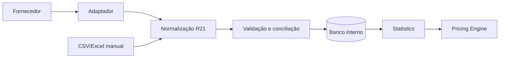

# Fornecedores de dados e odds

## 1. Princípio

**DECISÃO APROVADA:** o Pricing Engine não será acoplado a um fornecedor. Dados externos passam por adaptador, normalização e validação antes de entrar no banco interno.

## 2. Situação do discovery

- **FATO OBSERVADO:** a planilha não registra fornecedor ou procedência por partida.
- **DECISÃO APROVADA:** o MVP usará importação manual controlada.
- **LIMITAÇÃO:** nenhum fornecedor foi pesquisado, testado, contratado ou integrado nesta fase.
- **RECOMENDAÇÃO:** qualquer shortlist futura deve usar documentação oficial, licença, proposta comercial e teste de amostra; endpoints não oficiais e scraping não sustentam a arquitetura comercial.

## 3. Critérios para dados de futebol

Cada candidato deverá ser avaliado em matriz comparável:

| Dimensão | Verificação necessária |
|---|---|
| Cobertura | Países, competições, temporadas e histórico necessários |
| Estatísticas | Gols, primeiro tempo, finalizações, chutes no gol, escanteios, cartões e faltas |
| Entidades futuras | Jogadores, árbitros, escalações e estádios |
| Atualização | Frequência, atraso e correções posteriores |
| Qualidade | Completude, consistência, IDs estáveis e política de retificação |
| Licença | Uso interno, armazenamento, derivados, exibição e uso comercial |
| Limites | Requisições, concorrência, retenção e redistribuição |
| Custo | Implantação, mensalidade, excedentes e crescimento |
| Operação | Disponibilidade, SLA, status e reprocessamento |
| Documentação | Clareza, versionamento, exemplos e changelog |
| Suporte | Canal, tempo de resposta e tratamento de incidentes |

**DECISÃO PENDENTE:** pesos e nota mínima da matriz serão definidos antes da pesquisa comercial.

## 4. Estratégia por estágio

### 4.1 MVP

- arquivo manual controlado;
- Brasileirão Série A 2026;
- layout versionado;
- prévia, validação e conciliação;
- procedência declarada pelo administrador;
- sem atualização automática.

### 4.2 Piloto automatizado

- um fornecedor inicial com cobertura dos mercados necessários;
- sincronização diária de jogos encerrados e próximos jogos;
- comparação paralela com importação manual;
- medição de completude, atrasos e correções.

### 4.3 Comercialização

- fornecedor com licença comercial explícita;
- possibilidade de segundo fornecedor para cobertura ou contingência;
- processo de conciliação e monitoramento;
- custos e limites compatíveis com número de assinantes.

## 5. Importação manual controlada

O arquivo deverá possuir versão de layout e, no mínimo:

- data/hora e timezone;
- competição e temporada;
- mandante e visitante;
- estado da partida;
- gols do primeiro tempo e da partida;
- estatísticas do MVP quando aplicáveis;
- origem declarada e data de obtenção.

Fluxo:

1. receber arquivo sem executá-lo;
2. calcular hash e validar tamanho/extensão;
3. validar colunas e tipos;
4. normalizar nomes e datas;
5. detectar duplicidades e conflitos;
6. exibir prévia;
7. confirmar lote;
8. registrar auditoria e erros.

**RECOMENDAÇÃO:** arquivos Excel com macros nunca devem ser executados pelo importador.

## 6. Normalização e conciliação

### 6.1 Identidade

IDs externos são mapeados para IDs internos. Nomes alternativos são contexto auxiliar, não chave principal.

### 6.2 Duplicidade

Uma partida candidata a duplicata deve considerar fornecedor, ID externo, competição, data aproximada e participantes. A regra não deve confirmar automaticamente quando houver mudança de horário ou jogo remarcado.

### 6.3 Divergência

Quando duas fontes discordarem:

- preservar valores e fontes recebidos;
- aplicar regra de precedência versionada ou exigir decisão administrativa;
- registrar motivo da escolha;
- recalcular apenas resultados afetados;
- manter snapshots aprovados intactos.

### 6.4 Falha de atualização

- repetir com limite e intervalo controlados;
- não duplicar registros em nova tentativa;
- registrar cursor ou período concluído;
- alertar quando a defasagem exceder o limite aprovado;
- permitir reprocessamento por período e fornecedor.

## 7. Fornecedores de odds

### 7.1 Escopo futuro

**DECISÃO APROVADA:** odds ficam fora do MVP. A arquitetura deve suportar pelo menos duas casas no futuro.

Mercados iniciais recomendados para o piloto:

- resultado;
- handicap asiático;
- total de gols.

### 7.2 Critérios adicionais

- casas e regiões cobertas;
- mercados e linhas asiáticas;
- odds de abertura, intermediárias e fechamento;
- frequência e atraso;
- identificação de suspensão e indisponibilidade;
- histórico permitido pela licença;
- pré-jogo e ao vivo claramente separados;
- formato decimal e conversões;
- custo e limite de chamadas.

### 7.3 Histórico append-only

Cada captura cria nova `OddsObservation`. Atualizar a “odd atual” não apaga a anterior. Melhor odd, linha vigente e closing line serão consultas sobre o histórico.

### 7.4 Nomes e mercados

O adaptador traduz evento, casa, mercado, seleção e linha para o catálogo canônico. Uma tradução não reconhecida entra em quarentena, sem criar mercado improvisado.

## 8. Processo de seleção futuro

1. fechar competições, estatísticas e frequência necessárias;
2. solicitar documentação e termos oficiais;
3. preencher matriz de cobertura e licença;
4. obter amostra de dados;
5. comparar com partidas de referência;
6. medir completude, atraso e correções;
7. estimar custo no MVP e na comercialização;
8. revisar riscos jurídicos e contratuais;
9. registrar ADR e aprovação antes da integração.

## 9. Decisões pendentes

- orçamento e volume esperado;
- pesos da matriz de avaliação;
- direitos de armazenamento e exibição necessários;
- fonte e licença dos dados atualmente presentes na planilha;
- política de precedência entre fornecedores;
- limites aceitáveis de atraso e indisponibilidade;
- momento de iniciar o piloto automatizado;
- fornecedor de odds e definição de closing line.
