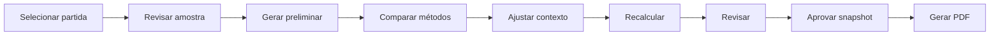

# Experiência do usuário e PDF

## 1. Direção de experiência

**DECISÃO APROVADA:** a central da partida será a principal experiência do produto.

As imagens de referência mostram padrões úteis de hierarquia — lista por data e competição, placar central, histórico dos times e abas de mercado. Elas não autorizam copiar marca, layout, textos, código ou identidade visual.

**RECOMENDAÇÃO:** a identidade do Linha de Valor deve privilegiar clareza analítica, rastreabilidade e comparação entre métodos, em vez de imitar um portal de resultados esportivos.

## 2. Arquitetura de navegação do MVP

```text
Início
├── Partidas
│   ├── Calendário e filtros
│   └── Central da partida
│       ├── Visão geral
│       ├── Precificação
│       ├── Gols
│       ├── Handicap
│       ├── Desempenho
│       ├── Confronto direto
│       └── Classificação
├── Competições
│   ├── Classificação
│   └── Ranking de gols
├── Times
│   └── Histórico
├── Importações
├── Configurações
└── Auditoria
```

Itens futuros, como odds, oportunidades, jogadores e assinaturas, não devem aparecer como telas vazias no MVP.

## 3. Lista de partidas

Filtros:

- data ou intervalo;
- competição e temporada;
- estado da partida e da precificação;
- busca por time;
- janela futura para geração preliminar.

Cada item deve mostrar horário, times, competição, estado da partida, estado da precificação e avisos de dados. Odds só serão exibidas quando a etapa correspondente for aprovada.

## 4. Central da partida

### 4.1 Cabeçalho

- competição, temporada, fase e rodada;
- mandante, visitante, data e local;
- estado da partida e da precificação;
- filtros e tamanho da amostra;
- ações permitidas: gerar, revisar, aprovar, criar revisão e gerar PDF.

### 4.2 Visão geral

- resumo dos históricos;
- forma recente;
- classificação;
- amostra dos dois times;
- avisos de baixa amostra ou dados ausentes;
- comparação sintética dos três métodos.

### 4.3 Aba de precificação

Apresentar uma linha por seleção com:

- probabilidade de cada método;
- odd justa;
- linha projetada quando aplicável;
- rótulo de confiança/amostra;
- acesso à explicação do cálculo;
- divergência entre métodos, sem concluir automaticamente qual está correto.

### 4.4 Abas de gols e handicap

- histórico mandante e visitante;
- valores a favor e cedidos;
- média, desvio-padrão e coeficiente de variação;
- frequências por linha;
- expectativas dos Métodos 1 e 2;
- linhas e liquidação do handicap;
- IDs ou datas das partidas da amostra.

### 4.5 Ajustes do Método 1

- exibir valor herdado e origem global/campeonato/partida;
- permitir edição somente ao administrador;
- exigir justificativa para ajuste de partida;
- mostrar antes/depois da média refinada;
- recalcular sem alterar revisão aprovada.

## 5. Fluxo de trabalho na interface



O botão de aprovação deve resumir modelo, versão, amostra e avisos. Aprovação com erro ou dado insuficiente deve ser bloqueada.

## 6. Cores e acessibilidade

- baixa: vermelho e rótulo “Baixa”;
- intermediária: amarelo/laranja e rótulo “Intermediária”;
- alta: verde e rótulo “Alta”.

**DECISÃO APROVADA:** limites iniciais são `<40%`, `40%–60%` e `>60%`.

Além da cor:

- usar texto, ícone ou padrão;
- garantir contraste;
- oferecer foco visível e navegação por teclado;
- não usar vermelho/verde como única diferença;
- manter casas decimais consistentes e explicar arredondamento.

### 6.1 Exibição matemática aprovada

Conforme `D-MATH-004`, a configuração inicial exibe probabilidades percentuais e odds justas com duas casas, lambdas e médias com três e linhas asiáticas em passos de 0,25. A interface deriva esses valores do bruto preservado e nunca recalcula a partir do valor arredondado.

O estado da amostra deve seguir `D-MATH-007`: insuficiente abaixo de 5 observações, baixa confiança de 5 a 9 e confiança padrão a partir de 10. O rótulo não deve sugerir garantia estatística e deve permitir consultar numerador, denominador, exclusões e filtros.

## 7. Estados vazios e falhas

- Sem partida: orientar seleção.
- Sem amostra: informar filtros que eliminaram jogos.
- Amostra pequena: mostrar quantidade e aviso.
- Estatística ausente: identificar mercado afetado.
- Erro de cálculo: exibir código compreensível e impedir aprovação.
- Job em andamento: mostrar estado e permitir atualização segura.
- PDF falhou: preservar snapshot e permitir nova tentativa sem nova aprovação.

## 8. PDF resumido do MVP

### 8.1 Objetivo

Produzir documento legível para consulta e compartilhamento autorizado, sem reproduzir a folha extremamente larga do Excel.

### 8.2 Estrutura recomendada

1. cabeçalho da partida e identificação da análise;
2. resumo executivo com amostra e principais probabilidades;
3. resultado, dupla chance e ambas marcam;
4. gols e totais;
5. handicap asiático;
6. classificação e forma;
7. metodologia, versões, filtros, avisos e responsável.

### 8.3 Metadados obrigatórios

- ID e revisão da precificação;
- data/hora da geração e timezone;
- modelo e versão de cada método;
- configuração e hierarquia resolvida;
- quantidade e filtros da amostra;
- disponibilidade dos dados;
- massa residual e avisos relevantes;
- erro tipado ou bloqueio de amostra, quando aplicável;
- responsável pela análise;
- versão do template do PDF.

### 8.4 Layout

- páginas A4, retrato ou paisagem apenas quando necessário;
- cabeçalho e rodapé consistentes;
- tabelas divididas por assunto;
- repetição de cabeçalho em tabela longa;
- nenhuma página vazia;
- nenhuma redução que torne o texto ilegível;
- indicação textual das faixas de probabilidade.

### 8.5 Geração e armazenamento

**RECOMENDAÇÃO:** gerar o PDF no servidor a partir de template versionado, em tarefa do worker. Guardar arquivo em armazenamento de objetos e metadados no banco.

**DECISÃO PENDENTE:** comparar geração por HTML/CSS renderizado com geração programática direta. A escolha deve considerar paginação, tabelas, fontes, segurança, testes e operação.

O download exige autorização e deve registrar auditoria quando necessário.

## 9. PDF completo futuro

Adicionar páginas temáticas para escanteios, finalizações, chutes no gol, cartões, faltas, jogadores, odds e observações. Conteúdo só entra quando o mercado correspondente estiver implementado e validado.

## 10. Testes de experiência e PDF

- navegação com teclado e diferentes tamanhos de tela;
- filtros persistentes e visíveis;
- rótulos e arredondamento consistentes;
- estados vazio, incompleto, erro e carregamento;
- comparação de métodos sem confusão visual;
- PDF com favorito forte, jogo equilibrado, muitas linhas e avisos;
- inspeção visual de todas as páginas;
- extração textual básica, cabeçalho, rodapé e ausência de página vazia;
- autorização de download.

## 11. Decisões pendentes

- identidade visual oficial;
- densidade e número de casas decimais por contexto;
- linhas de totais exibidas inicialmente;
- tecnologia de PDF;
- necessidade de assinatura ou marca d'água;
- política de armazenamento e expiração dos relatórios.

As restrições confirmadas do PDF legado e a baseline de validação estão em [Auditoria dinâmica e baseline matemático](12-dynamic-audit-and-mathematical-baseline.md#6-macros-e-testes-operacionais).
