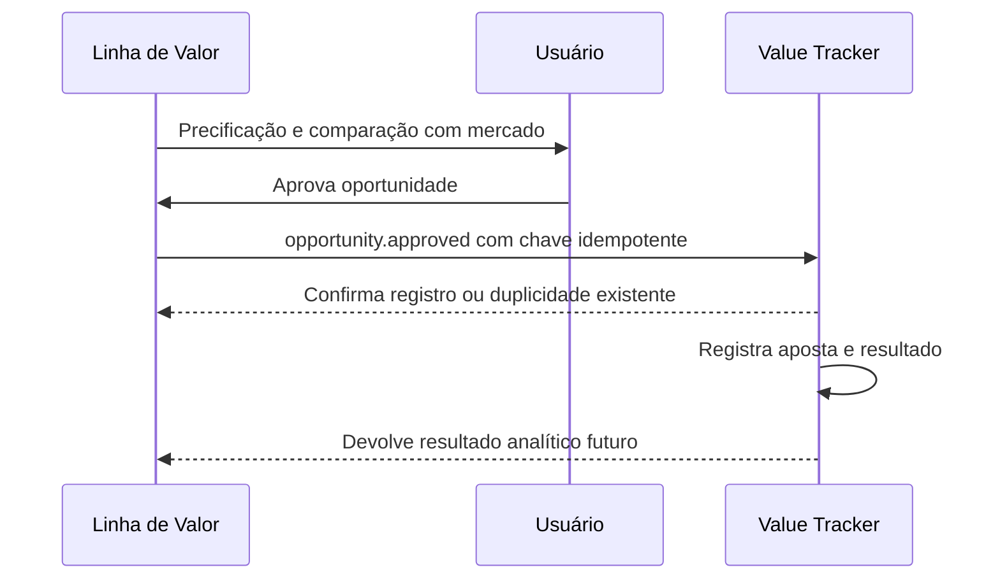

# Integração futura com o Value Tracker

## 1. Estado e objetivo

**DECISÃO APROVADA:** o Value Tracker será um produto posterior e não será desenvolvido no MVP do Linha de Valor.

Este documento evita que os dois produtos sejam acoplados incorretamente. Ele define fronteiras e um contrato conceitual, sem criar API, fila, evento real ou código compartilhado.

## 2. Fronteiras entre os produtos

### 2.1 Linha de Valor Football Intelligence

Responsável por:

- dados e identidade de futebol;
- estatísticas e amostras;
- modelos e configurações;
- precificações, probabilidades, odds justas e linhas;
- histórico de odds futuro;
- comparação com mercado;
- identificação e aprovação futura de oportunidades;
- snapshots e relatórios de análise.

### 2.2 Value Tracker

Responsável por:

- registro da aposta ou paperbet;
- unidades, stake e preço efetivamente obtido;
- resultado e retorno;
- lucro, ROI, yield e CLV;
- desempenho por modelo, versão, mercado e estratégia;
- diário operacional e auditoria financeira.

**RECOMENDAÇÃO:** o Value Tracker não deve recalcular a probabilidade original. Ele referencia o snapshot que fundamentou a decisão.

## 3. Identificadores compartilháveis

O contrato deverá transportar identificadores internos estáveis de:

- usuário;
- competição, temporada e partida;
- mercado, seleção e linha;
- precificação, revisão e snapshot;
- modelo e versão;
- observação de odd e casa;
- oportunidade.

IDs externos de fornecedores podem acompanhar metadados, mas não serão a identidade entre produtos.

## 4. Catálogo de mercados compartilhado

Os produtos precisam interpretar igualmente mercado, período, participante, seleção, linha, incremento, unidade e liquidação. A definição normativa está em [Regras de negócio e catálogo](03-business-rules-and-market-catalog.md).

**RECOMENDAÇÃO:** o catálogo deverá possuir versão explícita. Uma alteração incompatível exige nova versão do contrato, não mudança silenciosa.

## 5. Snapshot como evidência

Uma oportunidade futura deve referenciar:

- snapshot aprovado;
- probabilidade e odd justa daquele momento;
- versão dos modelos;
- amostra e filtros;
- observação de odd utilizada;
- horário e responsável pela aprovação.

O Value Tracker poderá armazenar um resumo necessário à operação, mas o Linha de Valor permanece fonte do snapshot analítico completo.

## 6. Evento `pricing.approved`

### 6.1 Finalidade

Notificar que uma precificação atingiu estado aprovado. O evento não significa que existe aposta ou oportunidade.

### 6.2 Conteúdo conceitual

- `event_id` único;
- `event_type = pricing.approved`;
- versão do contrato;
- horário UTC;
- ID da partida, precificação, revisão e snapshot;
- IDs e versões dos modelos;
- mercados disponíveis;
- responsável;
- referência autorizada para consulta.

**RECOMENDAÇÃO:** evitar transportar todo o snapshot no evento. Consumidores consultam detalhes autorizados por contrato.

## 7. Oportunidade futura

Fluxo previsto:

**DECISÃO PENDENTE:** o evento de integração poderá ser `opportunity.approved`, diferente de `pricing.approved`. O primeiro representa decisão operacional; o segundo, conclusão da análise.

## 8. Prevenção de duplicidades

- todo evento possui `event_id` único;
- toda oportunidade possui ID interno único;
- o Value Tracker registra a chave de idempotência antes de confirmar;
- repetir o mesmo evento retorna o registro já criado, sem duplicar aposta;
- reenvio e ordem fora de sequência devem ser suportados;
- correção cria nova versão ou evento compensatório, não alteração invisível.

## 9. Histórico de odds e CLV

O Linha de Valor preservará observações de abertura, intermediárias, selecionada e closing line quando a integração de odds existir. O Value Tracker armazenará o preço efetivo da aposta e utilizará referências compartilhadas para calcular CLV.

**DECISÃO PENDENTE:** definir metodologia oficial de CLV, fonte da closing line e tratamento de mudanças de linha.

## 10. Retorno para avaliação e calibração

O Value Tracker poderá devolver:

- liquidação final e resultado;
- preço efetivo;
- closing line e CLV calculado;
- desempenho agregado por modelo, versão e mercado.

**RECOMENDAÇÃO:** resultados operacionais não devem alterar automaticamente pesos ou modelos. Eles alimentam análise e proposta de nova versão, sujeita a validação e aprovação.

## 11. Segurança e disponibilidade

- autenticação entre produtos;
- autorização por finalidade;
- assinatura ou verificação de mensagens quando necessário;
- dados mínimos no evento;
- logs com correlação entre os dois produtos;
- repetição segura e fila de falhas;
- nenhuma dependência síncrona que impeça aprovar precificação se o Value Tracker estiver indisponível.

## 12. Contrato de integração futuro

Antes da implementação, produzir especificação versionada contendo:

- schemas de evento e consulta;
- autenticação e autorização;
- idempotência;
- erros e repetição;
- compatibilidade de versões;
- retenção e privacidade;
- testes de contrato;
- responsabilidades operacionais.

## 13. Decisões pendentes

- evento que inicia a integração: precificação ou oportunidade;
- localização da fonte normativa do catálogo;
- tecnologia de transporte;
- dados mínimos replicados;
- metodologia de CLV;
- política de exclusão/correção;
- modelo de identidade de usuário entre produtos.
