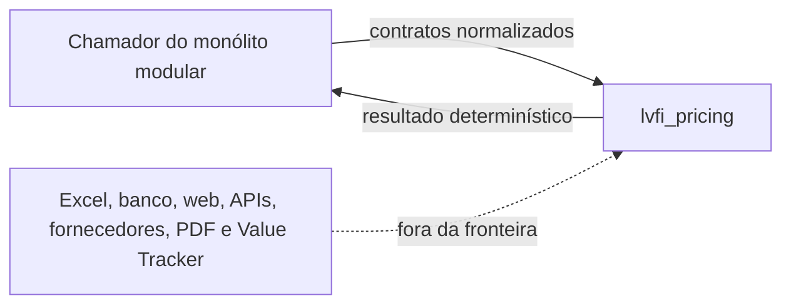
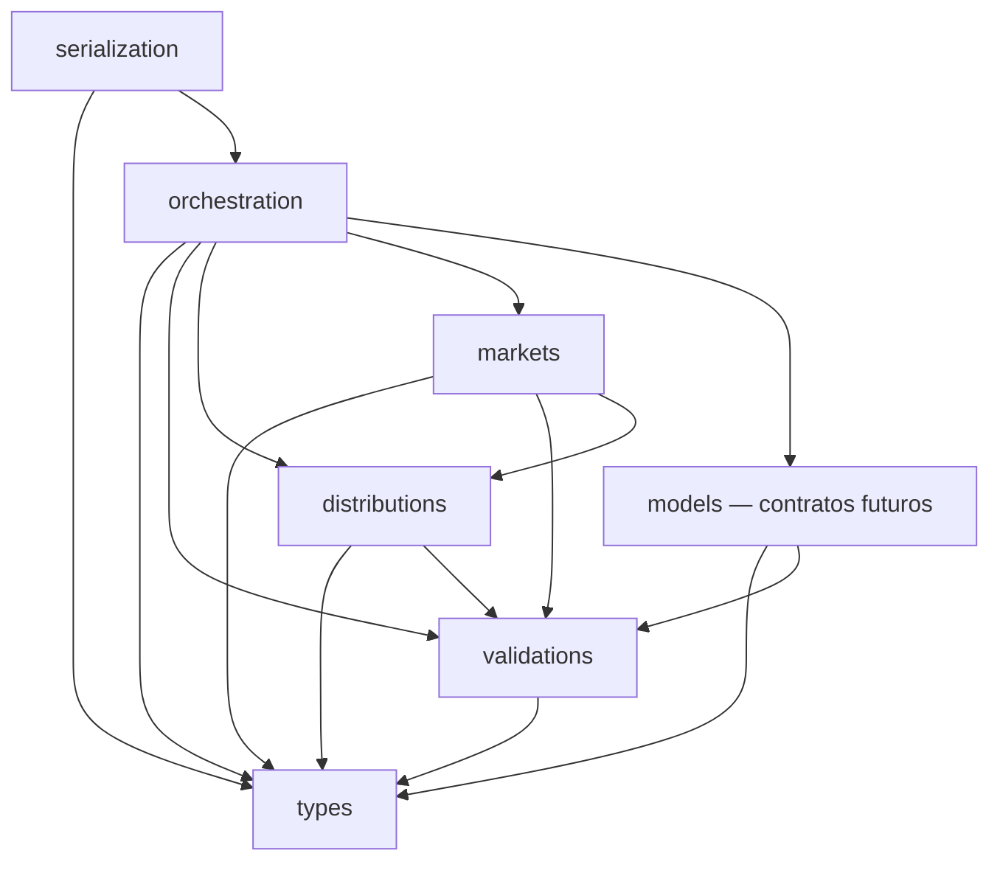

# Plano técnico do Pricing Engine

## 1. Resumo executivo

A `LVFI-ENG-001` concluiu o planejamento do desenvolvimento do Pricing Engine. Este documento consolida somente as decisões necessárias para a implementação controlada do núcleo matemático na `LVFI-ENG-002`; não cria nem autoriza aplicações, integrações ou os Métodos 1, 2 e 3.

O motor será um pacote Python puro, determinístico, sem I/O externo e com fronteira explícita dentro do monólito modular. A localização aprovada é `packages/pricing-engine/`, o namespace será `lvfi_pricing`, o runtime inicial será CPython 3.13.x e utilizará apenas a biblioteca padrão. As decisões arquiteturais vinculantes estão registradas nos ADRs `ADR-LVFI-001` a `ADR-LVFI-010`, com status `Aprovada`.

As regras matemáticas `D-MATH-001` a `D-MATH-016` permanecem vigentes. Em especial, o motor preservará a cauda probabilística, utilizará `binary64/float`, representará linhas asiáticas em quartos inteiros, manterá os cinco estados de liquidação e produzirá resultados e hashes reproduzíveis.

## 2. Objetivo do Pricing Engine

Receber entradas matemáticas já normalizadas e validadas, aplicar distribuições e regras de mercado versionadas e devolver resultados auditáveis, sem consultar ou modificar sistemas externos. Para as mesmas entradas, versões e configurações, o resultado canônico deve ser idêntico.

## 3. Fronteiras do motor

O Pricing Engine:

- recebe valores de domínio, configurações resolvidas e identificadores estáveis;
- valida finitude, domínio, consistência e tolerâncias;
- calcula distribuições, probabilidades, odds justas e linhas;
- devolve intermediários auditáveis, massa residual, erros e alertas tipados;
- serializa contratos de transporte e constrói um payload canônico de hash;
- não lê arquivos, variáveis de ambiente, relógio, banco, rede ou estado global mutável;
- não conhece Excel, fornecedores, frameworks web, persistência, interface, autenticação, PDF ou Value Tracker.



## 4. Escopo da LVFI-ENG-002

- fundação do pacote e ferramentas de qualidade;
- tipos imutáveis, contratos, validações, erros e alertas;
- política numérica e tolerâncias;
- distribuição Poisson adaptativa e distribuição de diferença de gols;
- matriz de placares somente para auditoria ou visualização;
- resultado, dupla chance, ambas marcam e totais de gols;
- liquidação e precificação do handicap asiático;
- request, result, orquestração fina, serialização canônica e `calculation_hash`;
- fixtures seguras, testes determinísticos, gerativos e de regressão;
- documentação da API interna e dos limites do pacote.

## 5. Itens fora do escopo

- Métodos 1, 2 e 3;
- Excel, XLSM, VBA e execução da planilha-oráculo;
- banco, ORM, PostgreSQL e migrations;
- API web, FastAPI, Django, front-end e autenticação;
- importação, fornecedores, odds de mercado, PDF e Value Tracker;
- NumPy, SciPy, Pydantic, pandas e `Decimal` no núcleo;
- implantação, fila, cache, observabilidade de aplicação e microsserviços;
- qualquer fixture privada completa ou evidência bruta no Git.

## 6. Sequência LVFI-ENG-002 a LVFI-ENG-005

| Initiative técnica | Resultado | Dependência | Limite principal |
|---|---|---|---|
| `LVFI-ENG-002` | Núcleo matemático, mercados, contratos e serialização do Pricing Engine | ADRs e este plano | Não implementa os Métodos 1, 2 e 3 |
| `LVFI-ENG-003` | Método 1 — médias com contexto | Núcleo aceito da `LVFI-ENG-002` | Sem integração web, banco ou PDF |
| `LVFI-ENG-004` | Método 2 — força relativa ao campeonato | Núcleo aceito e contratos de amostra | Sem integração web, banco ou PDF |
| `LVFI-ENG-005` | Método 3 — frequência observada | Núcleo aceito e contratos de amostra | Sem ampliar o catálogo aprovado |

Cada etapa exige plano, aprovação, implementação, validação e aceite próprios. A separação evita incorporar regras dos modelos ao núcleo de mercados.

## 7. Estrutura proposta do repositório

```text
packages/
└── pricing-engine/
    ├── pyproject.toml
    ├── README.md
    ├── src/
    │   └── lvfi_pricing/
    └── tests/
        ├── unit/
        ├── property/
        ├── regression/
        └── fixtures/
            ├── synthetic/
            └── sanitized/
```

Esta árvore é um desenho para a `LVFI-ENG-002-T02` em diante. A `LVFI-ENG-002-T01` não cria nenhum desses arquivos ou diretórios.

Aplicações em `apps/` só serão criadas quando uma aplicação real for iniciada. Não haverá `apps/web`, `apps/backend` ou microsserviço nesta Sprint.

## 8. Estrutura interna do pacote

| Área | Responsabilidade |
|---|---|
| `types` | value objects, enums, requests, results e versões |
| `validations` | regras de domínio, finitude, intervalos e consistência |
| `distributions` | Poisson, suporte adaptativo e diferença de gols |
| `markets` | probabilidades, liquidação e odds por mercado |
| `models` | portas e contratos para modelos futuros, sem Métodos 1, 2 ou 3 nesta etapa |
| `orchestration` | coordenação fina das operações, sem lógica matemática própria |
| `serialization` | JSON de transporte, payload canônico e hashes |

Erros, alertas e política numérica são capacidades transversais, mantidas próximas dos tipos fundamentais para evitar dependências cíclicas.

## 9. Grafo de dependências entre módulos

As setas indicam “depende de”.



Restrições vinculantes:

- `markets` não conhece `models`;
- `models` não conhece `markets`;
- `types` não depende das demais áreas;
- a orquestração não replica fórmulas;
- serialização não altera valores de domínio.

## 10. Contratos conceituais

| Contrato | Entrada | Saída | Invariante |
|---|---|---|---|
| Distribuição Poisson | lambda finito e não negativo, política de cauda | suporte, probabilidades, soma e residual | residual dentro da política ou erro tipado |
| Diferença de gols | duas distribuições independentes | probabilidades por diferença | massa explicada e auditável |
| Precificador de mercado | distribuições ou diferença e definição do mercado | seleções e probabilidades | catálogo e seleções canônicos |
| Liquidador asiático | diferença, seleção e linha em quartos | componentes e estado | stake total preservada |
| Precificador asiático | distribuição de diferenças e linha | estados, equivalentes e odd justa | pushes excluídos do preço |
| Orquestrador | `PricingRequest` imutável | `PricingResult` ou erro de domínio | nenhuma dependência externa |
| Serializador | objeto de contrato | JSON de transporte | sem recomputar ou arredondar |
| Hasher | payload canônico | SHA-256 | metadados voláteis excluídos |

## 11. Tipos de domínio

- `QuarterLine`: inteiro que representa quartos de unidade; `-3` equivale a `-0,75` apenas na apresentação;
- `Probability`: `float` finito no intervalo fechado `[0, 1]`;
- `FairOdds`: `float` finito e positivo quando o preço existe;
- `PoissonRate`: `float` finito e não negativo;
- `SettlementState`: vitória integral, meia vitória, reembolso, meia derrota ou derrota integral;
- `MarketCode`, `SelectionCode` e `PeriodCode`: enums com códigos canônicos estáveis;
- `CalculationError`, `CalculationWarning` e `ErrorCode`: falhas e alertas de domínio;
- `PricingRequest`, `PricingResult`, `DistributionResult` e resultados de mercado: dataclasses congeladas ou tipos imutáveis equivalentes;
- tipos de versão e revisão: valores explícitos, não textos incidentais.

Coleções expostas pelos contratos devem ter ordem definida e não permitir mutação observável.

## 12. Política numérica

- usar `binary64/float` em todos os cálculos do núcleo;
- rejeitar `NaN`, infinito positivo e infinito negativo nas fronteiras;
- usar `math.fsum` em somas numericamente relevantes;
- representar linhas asiáticas em quartos inteiros, sem comparação aproximada de linhas;
- não usar `Decimal`, NumPy ou SciPy no núcleo inicial;
- não aplicar clamp, renormalização ou correção silenciosa;
- preservar valores brutos; arredondamento pertence exclusivamente à apresentação;
- tornar toda diferença entre soma, residual e unidade explícita no resultado.

## 13. Política de tolerância

| Uso | Política inicial | Origem |
|---|---:|---|
| Regressão numérica | tolerâncias absoluta e relativa combinadas de `1e-8` | `D-MATH-002` |
| Totalização exaustiva | diferença não explicada máxima de `1e-12` | `D-MATH-006` |
| Residual da Poisson | máximo alvo de `1e-14` por distribuição | `ADR-LVFI-004` |
| Tipos, códigos, linhas, versões, componentes e ordem | igualdade exata | `D-MATH-002` |

A tolerância deve ser parte de configuração imutável e versionada. Ela não pode autorizar entrada inválida nem mascarar erro de programação.

## 14. Estratégia Poisson

A distribuição começa em `k = 0`, calcula as probabilidades de forma estável por recorrência e acumula os termos com soma precisa. Lambda zero é tratado pela própria definição da distribuição. O resultado registra lambda, limite alcançado, probabilidades, soma e massa residual.

A API não expõe uma lista truncada como se fosse uma distribuição integral. Quando um consumidor pedir suporte materializado, a política de cauda acompanha o resultado.

## 15. Cauda adaptativa

1. materializar inicialmente o suporte de `0` a `10`;
2. calcular a massa residual por distribuição;
3. ampliar o suporte enquanto o residual exceder `1e-14`;
4. encerrar quando o alvo for atingido;
5. impedir avanço além do limite técnico inicial de segurança `1.000`;
6. retornar erro tipado de não convergência se o limite for atingido;
7. nunca descartar, ocultar ou normalizar silenciosamente a cauda.

Essa política produz uma divergência deliberada e aprovada em relação à matriz legada `0–6`.

## 16. Matriz auditável

A matriz de placares é uma projeção materializada das distribuições independentes, destinada a auditoria ou visualização. Ela registra limites dos eixos, massa incluída e residual de cada distribuição.

Os mercados analíticos não dependem de uma matriz recortada. Resultado, totais e handicap devem usar distribuições integrais/adaptativas ou a distribuição de diferença de gols, evitando que um limite visual altere o preço.

## 17. Mercados

O catálogo inicial da `LVFI-ENG-002` cobre:

- resultado `1X2`;
- dupla chance `1X`, `X2` e, se solicitado por contrato futuro, `12` sem exposição automática;
- ambas marcam `sim/não`;
- totais de gols, incluindo linhas compatíveis com liquidação asiática;
- handicap asiático para mandante e visitante no catálogo aprovado.

Cada resultado preserva mercado, período, participante, seleção, linha, probabilidade bruta, odd justa quando definida, versão do catálogo e evidência numérica necessária à auditoria.

## 18. Handicap asiático

- representar a linha como inteiro de quartos;
- decompor linhas de quarto nas duas linhas adjacentes;
- dividir a stake conceitual em partes iguais;
- liquidar cada componente e combinar sem perder os cinco estados;
- calcular `vitórias equivalentes = P(vitória integral) + 0,5 × P(meia vitória)`;
- calcular `perdas equivalentes = P(derrota integral) + 0,5 × P(meia derrota)`;
- calcular `odd justa = 1 + perdas equivalentes / vitórias equivalentes` quando houver vitórias equivalentes;
- excluir reembolsos do preço, sem excluí-los da auditoria;
- escolher como linha principal a odd justa mais próxima de `2,00`;
- desempatar pela linha mais próxima de zero e depois pela ordem simétrica canônica;
- preservar todas as linhas calculadas.

## 19. Erros e alertas tipados

`CalculationError` representa impedimento para produzir um resultado válido. `CalculationWarning` representa uma condição observável que não corrompe o cálculo, mas pode afetar aprovação ou publicação.

Cada ocorrência contém ao menos código estável, mensagem segura, campo ou etapa afetada e flags separadas para:

- bloqueio do cálculo;
- bloqueio da aprovação;
- bloqueio da publicação.

Falha crítica nunca vira vazio, zero, `NaN` ou infinito. Exceções internas continuam possíveis para erros de programação, mas não são o contrato final do domínio.

## 20. Serialização canônica

Haverá dois produtos distintos:

1. JSON de transporte, legível pelos consumidores autorizados;
2. payload canônico de hash, mínimo e determinístico.

Regras canônicas:

- objetos com chaves ordenadas;
- arrays com ordem preservada e semanticamente definida;
- `float` codificado por `float.hex()`;
- enums codificados por códigos canônicos estáveis;
- timestamps de transporte em UTC;
- ausência representada por `null`;
- codificação textual e versão do schema explícitas;
- nenhum arredondamento ou formatação localizada.

## 21. `calculation_hash`

O `calculation_hash` usa SHA-256 sobre o payload canônico. Entram no payload os dados determinísticos que definem o cálculo: request normalizado, versões do pacote/modelo/catálogo/schema, revisão e hash da configuração, identificadores e hashes aprovados de dados/amostras e resultado matemático canônico conforme o contrato versionado.

Ficam fora: horário de execução, duração, host, processo, ID de log, ID de correlação, caminho local e outros metadados voláteis. Timestamps que sejam parte real e imutável da entrada de negócio só entram quando o schema os declarar semanticamente necessários.

## 22. Versionamento

| Elemento | Política |
|---|---|
| Pacote | SemVer próprio |
| Modelo matemático | SemVer próprio; alteração matemática exige nova versão |
| Catálogo de mercados | SemVer próprio |
| Schemas de request, result e serialização | SemVer próprio |
| Configuração | revisão imutável, hash e vínculo com a anterior |
| Dados e amostras | identificadores estáveis e hashes do conteúdo autorizado |
| Precificação | revisão monotônica; versão aprovada é imutável |

Mudança exclusivamente visual não altera versão matemática. Mudanças incompatíveis de contrato exigem incremento de versão apropriado e plano de migração do consumidor.

## 23. Estratégia de fixtures

- manter a suíte privada completa fora do Git;
- versionar somente fixtures sintéticas ou sanitizadas e minimizadas;
- remover nomes de times, partidas, datas, fontes, caminhos, IDs privados e históricos;
- usar `JR-01` a `JR-14` apenas como identificadores de cobertura;
- revisar propriedade intelectual e minimização antes de cada inclusão;
- separar regressão do legado de regras normativas futuras;
- criar o harness inicial na `T05`, antes da Poisson e dos mercados;
- ampliar a cobertura durante a Sprint sem trazer evidência bruta ao repositório.

As métricas agregadas aprovadas — 14 fixtures, 16 execuções, 350 comparações, 408 validações asiáticas e repetibilidade do `JR-14` — podem orientar cobertura sem revelar valores privados.

## 24. Estratégia de testes

- testes unitários de value objects, validações, Poisson, mercados, liquidação, serialização e hash;
- testes de propriedades para conservação de massa, complementaridade, simetria, monotonicidade aplicável e decomposição de stake;
- regressão contra resultados sintéticos e sanitizados aprovados;
- verificação específica da divergência deliberada entre cauda adaptativa e matriz legada `0–6`;
- igualdade exata para contratos categóricos e tolerâncias oficiais para números;
- determinismo repetido do `calculation_hash`;
- testes negativos para não finitos, domínios inválidos, não convergência e preço indefinido;
- cobertura mensurada como sinal de lacunas, sem substituir testes significativos.

## 25. Ferramentas

- CPython 3.13.x, com CI fixada na versão menor `3.13` e patches atualizados de forma controlada;
- biblioteca padrão como única dependência de runtime inicial;
- `pytest` e `pytest-cov` para testes e cobertura;
- Hypothesis para propriedades e casos de borda;
- Ruff para lint e formatação;
- mypy em modo estrito para tipagem estática.

NumPy e SciPy exigem necessidade comprovada ou benchmark aprovado. Pydantic permanece fora do núcleo. `Decimal` só poderá ser considerado em uma futura camada de apresentação após decisão explícita de arredondamento.

## 26. Desempenho

Correção, determinismo e auditabilidade prevalecem sobre micro-otimizações. A implementação deve evitar recomputações óbvias, permitir reuso imutável de distribuições dentro de uma execução e manter limites de segurança contra entradas patológicas.

O orçamento de desempenho e o conjunto de medição serão definidos antes do gate final da `T13`, usando apenas dados sintéticos ou sanitizados. Nenhum benchmark é executado nesta tarefa documental, e nenhuma dependência numérica será adicionada sem evidência comparável.

## 27. Segurança

- nenhuma rede, arquivo, banco, shell ou variável de ambiente no núcleo;
- nenhuma execução de XLSM, VBA ou conteúdo importado;
- nenhuma credencial, segredo, caminho local ou dado proprietário em mensagens de erro;
- limites explícitos para suporte adaptativo e tamanho de payload;
- serialização sem objetos arbitrários ou execução dinâmica;
- fixtures submetidas a revisão de minimização e propriedade intelectual;
- resultados de domínio separados de logs e metadados operacionais.

## 28. Backlog atualizado

| Ordem | Task | Entrega | Dependências |
|---:|---|---|---|
| 1 | `LVFI-ENG-002-T01` | ADRs e plano técnico | `LVFI-ENG-001` aprovada |
| 2 | `LVFI-ENG-002-T02` | Fundação do pacote e ferramentas | T01 aceita |
| 3 | `LVFI-ENG-002-T03` | Erros, números e tolerâncias | T02 |
| 4 | `LVFI-ENG-002-T04` | Value objects e contratos fundamentais | T03 |
| 5 | `LVFI-ENG-002-T05` | Fixtures seguras e harness inicial de regressão | T04 |
| 6 | `LVFI-ENG-002-T06` | Distribuição Poisson | T05 |
| 7 | `LVFI-ENG-002-T07` | Diferença de gols e matriz auditável | T06 |
| 8 | `LVFI-ENG-002-T08` | Mercados básicos | T07 |
| 9 | `LVFI-ENG-002-T09` | Liquidação asiática | T07 |
| 10 | `LVFI-ENG-002-T10` | Precificação asiática e linha principal | T09 |
| 11 | `LVFI-ENG-002-T11` | Request, result e orquestração | T08 e T10 |
| 12 | `LVFI-ENG-002-T12` | Serialização e `calculation_hash` | T11 |
| 13 | `LVFI-ENG-002-T13` | Validação final, cobertura, tipagem, lint, desempenho e documentação | T12 |

A `T05` poderá crescer durante a Sprint, mas seu harness mínimo e a revisão de segurança das fixtures devem existir antes da implementação da Poisson e dos mercados.

## 29. Critérios de aceite

- pacote isolado e sem I/O externo, conforme `ADR-LVFI-001` e `ADR-LVFI-002`;
- runtime apenas com biblioteca padrão e matriz de desenvolvimento aprovada;
- todos os valores não finitos rejeitados e nenhuma correção silenciosa;
- Poisson converge ao residual alvo ou retorna erro tipado;
- distribuições exaustivas totalizam dentro de `1e-12`, com residual explicado;
- mercados básicos respeitam complementaridade e catálogo;
- handicap preserva decomposição, stake e cinco estados;
- linha principal respeita proximidade de `2,00`, zero e simetria;
- serialização e hash são determinísticos e versionados;
- testes, cobertura, Ruff e mypy estrito passam nos gates definidos na `T13`;
- nenhuma fixture privada, evidência bruta ou dependência proibida entra no Git;
- documentação explica API, invariantes, versões, riscos e divergência deliberada do legado;
- Métodos 1, 2 e 3 permanecem ausentes da `LVFI-ENG-002`.

## 30. Riscos

| Risco | Impacto | Mitigação |
|---|---|---|
| Instabilidade numérica em lambdas ou caudas extremas | preço ou massa incorretos | finitude, `math.fsum`, suporte adaptativo, limite e propriedades |
| Matriz visual virar dependência de cálculo | retorno ao truncamento legado | API analítica separada e testes de divergência |
| Semântica asiática ambígua | odd incorreta | quartos inteiros, decomposição canônica e casos por margem |
| Contrato canônico mudar sem versão | hashes incompatíveis | schemas e política SemVer separados |
| Fixture revelar propriedade intelectual | exposição indevida | minimização, sanitização, revisão e suíte privada fora do Git |
| Orquestrador concentrar lógica | acoplamento e baixa testabilidade | módulos independentes e orquestração fina |
| Otimização prematura introduzir dependências | complexidade sem evidência | benchmark aprovado antes de qualquer inclusão |
| Mistura dos Métodos 1–3 no núcleo | quebra da sequência aprovada | fronteira de `models` e gates separados `ENG-003` a `005` |

## 31. Decisões pendentes

Não há decisão arquitetural pendente que bloqueie a `LVFI-ENG-002-T02`. Permanecem como decisões de detalhe a serem fechadas nos respectivos planos, sem reabrir `D-MATH-001` a `D-MATH-016`:

- nomes finais da API pública e catálogo inicial completo de `ErrorCode` na `T03/T04`;
- formato físico exato dos arquivos de fixtures seguras na `T05`;
- orçamento quantitativo de desempenho e ambiente de medição na `T13`;
- critérios futuros para adotar NumPy, SciPy ou `Decimal`, somente após necessidade comprovada;
- contratos de integração com aplicação, persistência e PDF, fora da `LVFI-ENG-002`.

## 32. Gate de implementação

O gate de entrada desta Task era **GO COM CONDIÇÕES PARA IMPLEMENTAÇÃO DA LVFI-ENG-002**. As condições eram formalizar, revisar, versionar e aceitar os ADRs antes do primeiro código.

Os ADRs obrigatórios foram formalizados com status `Aprovada`, o backlog antecipa fixtures seguras e este plano preserva as decisões matemáticas e os limites do produto. A revisão e o versionamento se completam com a validação e o commit desta entrega.

**GO PARA IMPLEMENTAÇÃO CONTROLADA DA LVFI-ENG-002.**

O GO autoriza iniciar somente a próxima Task aprovada, `LVFI-ENG-002-T02`, após seu plano específico e aprovação. Não autoriza Métodos 1, 2 e 3, aplicações, banco, API, front-end, PDF, integrações ou qualquer item fora do escopo.

## Referências

- [Company Context](../../company/company-context.md)
- [R21 Development Framework](../../development-framework/README.md)
- [Regras de negócio e catálogo de mercados](03-business-rules-and-market-catalog.md)
- [Modelos de precificação](04-pricing-models.md)
- [Requisitos](05-requirements.md)
- [Domínio e modelo de dados](06-domain-and-data-model.md)
- [Arquitetura](07-architecture.md)
- [MVP, roadmap e estratégia de validação](11-mvp-roadmap-and-validation.md)
- [Auditoria dinâmica e baseline matemático](12-dynamic-audit-and-mathematical-baseline.md)
- [ADR-LVFI-001](../../architecture/decisions/ADR-LVFI-001-estrutura-do-repositorio-do-pricing-engine.md) a [ADR-LVFI-010](../../architecture/decisions/ADR-LVFI-010-ferramentas-e-dependencias.md)
